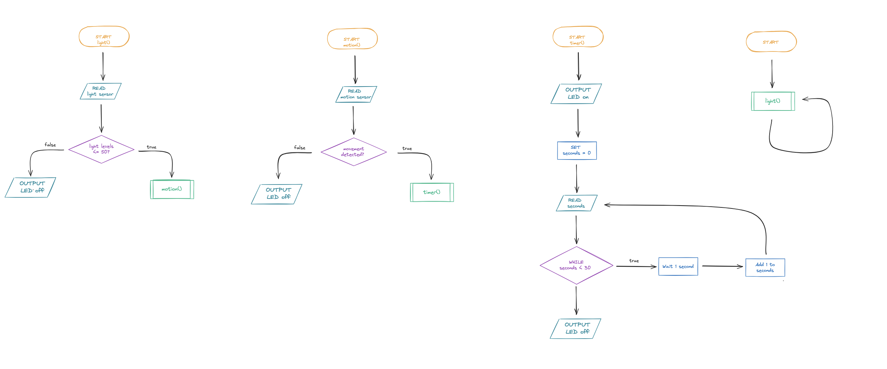

# ***Assessment Task 2***

## ***Requirements Outline***


### **Defining the Purpose**

#### The Need
Waking up at 2:00 AM to use the bathroom or other activities and either stubbing your toe in the dark or blinding yourself by turning on the lights and being unable to go back to sleep.

#### Proposed Solution
We will design a lighting system that can be plugged into any room with a power outlet. The system will only activate when it is dark. It uses both motion and light sensors: when motion is detected once dark enough, the light will turn on for 30 seconds before turning back off. If the system detects sufficient light again, such as sunlight or a room light being switched on, it will automatically turn off.

### **Identify Key Actions**

- The microcontroller reads the light sensor to determine whether the room is dark or bright.
- If the room is dark, the microcontroller monitors the motion sensor for movement.
- When movement is detected in the dark, the microcontroller sends a signal to switch the LED light on.
- The microcontroller starts a 30-second timer and keeps the LED on while the timer is running.
- After 30 seconds, the microcontroller switches the LED off. If the light sensor detects enough light (such as sunlight or another light on), the microcontroller keeps the LED off until the room becomes dark again.


### **Functional Requirements**

The machine requires:    
- Light Sensor Input: If light levels are high (daylight or other lights on), the system must remain in sleep mode and keep the LED output off.
- Motion Sensor Input: If the room is dark and the PIR sensor detects human movement, the system must trigger the LED turning on event.
- LED Output: When there's motion detection in the dark, the LED must instantly turn on and project a gentle glow.
- Timer Control: The system must keep the LED illuminated for exactly 30 seconds after motion is detected, then automatically turn the LED off if no further movement is sensed.
- Gentle glow must be 450 lumens to keep brightness down not to affect users eyes or senses. (otherwise could get flashed)


### **Test Cases**


| Test Case | Input     | Expected Output   |
|---------- |---------- |----------------   |
|Other light source is on and motion sensor detects movement.|Light sensor detects that the room is bright.|LED stays off.|
|No other light source is in the room, motion sensor detects movement.|Light sensor detects that the room is dark, motion sensor detects movement.|LED turns on.|
|Machine emits light, and 30 seconds have passed.|30 second timer is done.|LED turns off. 


### **Non-Functional Requirements**

**Efficiency**
The system should only use power when needed, not wasting energy unecessarily. It should stay off when there is another light ssource present and turn on only when it's dark and motion is detected.

**Response Time**
The light should switch on immediantly (roughly within 1-2 seconds) after motion is detected in a dark room.

**Accuracy**
The system should reliably detect movement in only the dark and emit light when both conditions are met (movement and darkness). It should also turn off exactly in or roughly 30 seconds.


## ***Algorithms***

### Flow chart



### Pseudocode


    BEGIN 
        REPEAT CONTIONOUSLY
            CALL light()
        END REPEAT

    END


    BEGIN light()
        READ light sensor
        IF light levels <= 50 THEN
            CALL motion()
        ELSE
            OUTPUT LED off
        END IF
    END light()


    BEGIN motion()
        READ motion sensor
        IF motion is detected THEN
            CALL timer()
        ELSE 
            OUTPUT LED off
        END IF
    END motion()


    BEGIN timer()
        OUTPUT LED on
        SET seconds = 0
        WHILE seconds < 30
            WAIT 1 second
            ADD 1 to seconds
        END WHILE
        OUTPUT LED off
    END timer()


## ***Development and Intergration***
***First attempt***

```Python 
from machine import Pin, ADC
import time

light_sensor = ADC(26) # LDR (light sensor) 
motion_sensor = Pin(15, Pin.IN) # PIR (motion sensor)
led = Pin(16, Pin.OUT) # LED (light)
led = Pin(16, Pin.OUT) # LED (light)
#LIght sensor function

def light():
    light_level = light_sensor.read_u16()  
    if light_level <= 50: # Reads light levels if they are above 50 then move onto motion detect func
        motion_detect()
    else:
        led.off()

# timer funtion 
def seconds():
    led.on()
    timer = 0
    while timer < 30: #while the timer is less than 30 add 1 more second until it is 30 or above then turn LED off
        time.sleep(1) # 1 second delay
        timer += 1
    led.off()
# motion_detect function
def motion_detect():
    if motion_sensor.value() == 1:   # #If motion_sensor value = 1 then motion is detected
        seconds()
    else:
        led.off()
# Main program
while True:
    light()
    time.sleep(0.1)
 ```


## ***Testing and Debugging***
Copy your code from every subsequent test into a code block in Markdown. You will be provided with an evaluation scaffold to reflect on each test. 

### **Test Case**
Choose a test case
Write a brief outline of what you need to do to meet the requirements of the test case.

### **Outline Plan**

### **Final Product**
For your final submission, you will need to:

Film a video of your final product working. Include this in your Github repo if it fits, or submit separately to Google Classroom.

Include all final Thonny / VS Code files and folder structure in your Github, all test cases in your documentation, and include all commits. 

### **Evaluation of Process**

Evaluate your process in solving this test case. 

Consider the following in your answer: 

How successful were you in meeting the test case requirements?

What steps did you take to identify and fix errors?

What went particularly well?

What challenged you?

What areas of your program could be improved based on the test results?

It is recommended you write 3-4 sentences for each test case. 

## ***Evaluation***
Provide peer evaluations from other team members.

Provide an individual project evaluation in relation to peer feedback, achievement of functional and non-functional requirements, final performance, project management and suggestions for future improvement.

### **Peer Evaluation - PMI**

|Plus|Minus|Interesting|
|---------- |---------- |----------------   |
|-      | -          | - hi                 |
|       |            |                      |
Reviewed by:


|Plus|Minus|Interesting|
|---------- |---------- |----------------   |
|- The LED is quite bright and allows for high visibility within the space  |  The device's wiring seems comlicated and messy|The features of the device itself seems to work quite well it would be better if there was a comparison to see it working within bright and dark areas to obtain a proper comparasion|
|The response time of the device is rapid and responsive to objects within feasible distance| The LED turns off at a seemingly random time so it might come as a shock to see the device just turn off, add and indicator to when it will turn off perhaps.| Although messy the device seemed comprehensive and cohesive so that it was able to be easily used to fit its purpose.|
Reviewed by: Pradhyot Narasimha


 


|Plus|Minus|Interesting|
|---------- |---------- |----------------   |
|-      | -          | - hi                 |
|       |            |   - good stufff                   |
Reviewed by: 


### **Final Evaluation**

Each should include at least one paragraph in response:

Evaluate your Final Test in Relation to Functional Criteria
Evaluate your Final Test in Relation to Non-Functional Criteria
Evaluate your Final Performance in Relation to the Identified Need
Evaluate your Project in Relation to Project Management
Evaluate your Project in Relation to Peer Feedback.
Justify Future Improvements you could make to your Final Product


